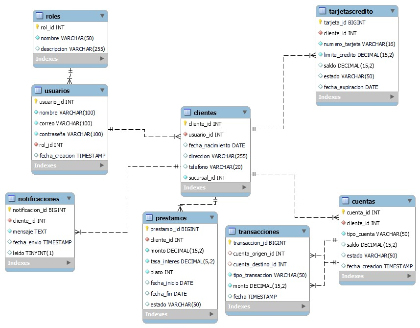

# Sistema Bancario

## Descripción

Este proyecto es un sistema bancario avanzado que permite la gestión de usuarios, cuentas, transacciones, préstamos, tarjetas de crédito y notificaciones. Está diseñado para proporcionar una plataforma robusta y segura que soporta múltiples roles de usuario, operaciones bancarias, y funcionalidades adicionales, tales como auditoría y monitoreo de transacciones. La aplicación permite a los usuarios realizar operaciones CRUD en sus cuentas, así como realizar transferencias y otras transacciones de forma segura.

## Características Principales

- **Gestión de Roles y Usuarios**: La aplicación distingue entre dos tipos de roles principales: Clientes y Administradores. Cada usuario tiene permisos basados en su rol, lo cual facilita la gestión de accesos y asegura que solo usuarios autorizados puedan realizar acciones específicas.
  
- **Cuentas Bancarias**: Los clientes pueden abrir y gestionar múltiples tipos de cuentas bancarias. Cada cuenta incluye información como tipo, saldo, y estado, permitiendo que los clientes manejen sus finanzas de forma organizada.

- **Transacciones**: Los usuarios pueden realizar diferentes tipos de transacciones, incluyendo depósitos, retiros, y transferencias entre cuentas. Cada transacción se registra con detalles importantes, tales como monto y fecha, para permitir auditorías y monitoreo de actividad.

- **Préstamos**: Los clientes pueden solicitar préstamos con detalles específicos sobre el monto, tasa de interés, plazo y estado. La aplicación permite al banco monitorear el estado de cada préstamo, lo cual facilita la gestión de crédito.

- **Tarjetas de Crédito**: Los clientes pueden solicitar y gestionar tarjetas de crédito, con información detallada sobre el número de tarjeta, límite de crédito, saldo actual, y estado. Esto proporciona una solución adicional para manejar créditos y finanzas.

- **Notificaciones**: La aplicación envía notificaciones automáticas a los clientes sobre transacciones y otros eventos importantes. Los mensajes se almacenan y se pueden consultar en cualquier momento, lo cual mejora la comunicación y transparencia con los usuarios.


## Diagrama de la Base de Datos



## Tablas y Relaciones

### 1. **Roles**
   - `rol_id`: Identificador único del rol.
   - `nombre`: Nombre del rol (e.g., Cliente, Administrador).
   - `descripcion`: Descripción del rol y sus permisos.

### 2. **Usuarios**
   - `usuario_id`: Identificador único del usuario.
   - `nombre`: Nombre completo del usuario.
   - `correo`: Correo electrónico único para cada usuario.
   - `contraseña`: Contraseña del usuario.
   - `rol_id`: Identificador del rol asociado al usuario.

### 3. **Clientes**
   - `cliente_id`: Identificador único del cliente.
   - `usuario_id`: Relación con la tabla de Usuarios.
   - `fecha_nacimiento`: Fecha de nacimiento del cliente.
   - `direccion`: Dirección física del cliente.
   - `telefono`: Número de contacto del cliente.

### 4. **Cuentas**
   - `cuenta_id`: Identificador único de la cuenta.
   - `cliente_id`: Relación con la tabla de Clientes.
   - `tipo_cuenta`: Tipo de cuenta (e.g., Ahorro, Corriente).
   - `saldo`: Saldo actual de la cuenta.
   - `estado`: Estado de la cuenta (e.g., Activa, Suspendida).

### 5. **Transacciones**
   - `transaccion_id`: Identificador único de la transacción.
   - `cuenta_origen_id`: Relación con la cuenta de origen.
   - `cuenta_destino_id`: Relación con la cuenta de destino.
   - `tipo_transaccion`: Tipo de transacción (e.g., Depósito, Retiro, Transferencia).
   - `monto`: Monto de la transacción.
   - `fecha`: Fecha y hora de la transacción.

### 6. **Préstamos**
   - `prestamo_id`: Identificador único del préstamo.
   - `cliente_id`: Relación con la tabla de Clientes.
   - `monto`: Monto del préstamo.
   - `tasa_interes`: Tasa de interés aplicada al préstamo.
   - `plazo`: Plazo de pago en meses.
   - `estado`: Estado del préstamo (e.g., Activo, Pagado, Moroso).

### 7. **Tarjetas de Crédito**
   - `tarjeta_id`: Identificador único de la tarjeta de crédito.
   - `cliente_id`: Relación con la tabla de Clientes.
   - `numero_tarjeta`: Número único de la tarjeta de crédito.
   - `limite_credito`: Límite de crédito asignado.
   - `saldo`: Saldo actual de la tarjeta.
   - `estado`: Estado de la tarjeta (e.g., Activa, Suspendida).

### 8. **Notificaciones**
   - `notificacion_id`: Identificador único de la notificación.
   - `cliente_id`: Relación con la tabla de Clientes.
   - `mensaje`: Mensaje enviado al cliente.
   - `fecha_envio`: Fecha de envío de la notificación.
   - `leido`: Indica si el cliente ha leído la notificación.

## Instalación y Configuración

1. Clona el repositorio:
   ```bash
   git clone https://github.com/usuario/sistema-bancario.git
   cd sistema-bancario

